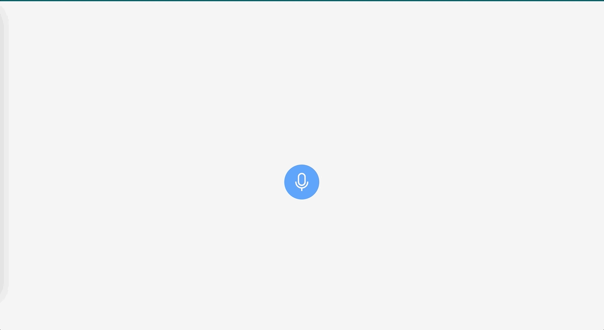

# A Dummy Voice Recorder Component.

Clone the project

```shell script
git clone https://github.com/petermwash/voice-recorder.git
```

Install dependencies

In the root project directory run the following command.

```shell script

npm install

```

To run the application use the following command.

```shell script

npm run dev

```

Screen capture.


